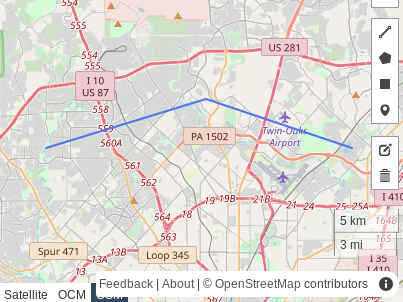

## What is "geospatial"?
- Any data or system dealing with locations on Earth
- And the analysis of that data to solve problems

AKA - geographic information systems (**GIS**)


## Geospatial Questions
- How far away is something from something else?
- How are things distributed across space?
- What things exist (or don't exist) near other things?
- What's the optimal route between one location and another?


## Data Types
- vector: discrete objects - points, lines, and polygons
- raster: continuous surfaces - cells in a grid


##
<h1>Data Structures</h1>


## Point
tuple of `(longitude, latitude)`  
or `(x, y)`
  
```
(-98.632, 29.551)
```


## Line
array of points
```
[(-98.632, 29.551), (-98.522, 29.58), (-98.422, 29.551)]
```



## Polygon
array of points - first and last point are the same
```
[(-98.632, 29.551), (-98.522, 29.58), (-98.422, 29.551), (-98.538, 29.465), (-98.632, 29.551)]
```


## Data Formats
- GeoJSON: open IETF [standard](https://tools.ietf.org/html/rfc7946)
- shapefile
  - not a fully open standard, but widely used
- well-known text (WKT) and well-known binary (WKB)
- raster: (Geo)TIFF, and many others


## Important Concepts
- computational geometry
- graph theory
- tree structures
- 3D graphics


##
<h1>Tools</h1>


## Databases
- PostgreSQL (PostGIS)
- SQLite (SpatialLite)
- extensions to proprietary products (Oracle, SQL Server, etc.)
- NoSQL
- elastic


## Core Libraries
- **fiona** (Python): easily read/write various vector data formats
- **shapely** (Python): perform geometric operations and spatial analysis
- **GeoTools** (Java): huge library with pretty much any geo stuff you might need
- **PROJ** (C++): for working with map projections
- **GDAL** (C++): everything you need for working with raster data
- [Many more](https://github.com/sacridini/Awesome-Geospatial)


## Web Mapping SDKs
- OpenLayers: full-featured framework for creating web-based GIS apps
- leaflet: lightweight framework for creating responsive web maps
- Google Maps APIs


## Platforms
- ArcGIS
- Mapbox 
- Carto
- GeoServer


## New Hotness
- LIDAR and high-resolution sensing
- indoor mapping
- image recognition and AI
- autonomous vehicles and telematics


## More Info
- [_GIS Fundamentals_](https://www.paulbolstad.net/gisbook.html) book, by Paul Bolstad
- libraries: <https://github.com/sacridini/Awesome-Geospatial>
- [applications and use cases](https://gisgeography.com/gis-applications-uses/)


##
<h1>Story Time</h1>
